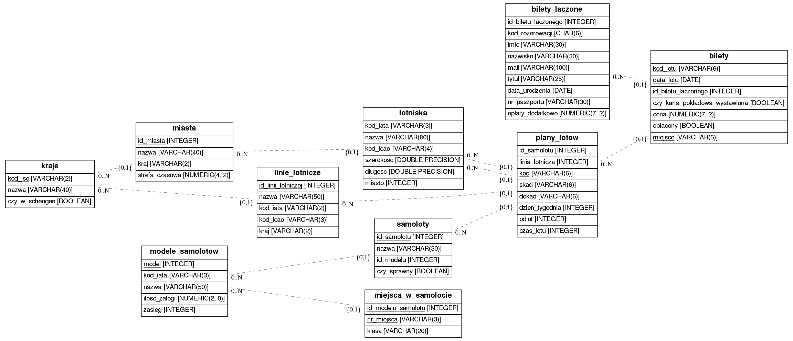

# projekt_id

Set up:

sudo apt-get install postgresql-plpython3

Contains information from OpenFlights Airports Database, which is made available [here](https://openflights.org/data.html) under the Open Database License (ODbL).

